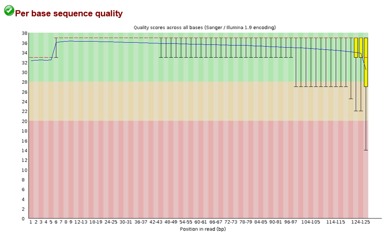

# metagenomics_gut_microbiome

The goal of this repository is to build a bioinformatics pipeline to assess a mock community of bacteria subsampled from the [Tara Oceans project](http://ocean-microbiome.embl.de/companion.html). The mock dataset can be found in the tutorial [here](https://www.hadriengourle.com/tutorials/meta_assembly/).

This pipeline will consist of the following steps.

- Check the raw data (fastq files) quality with FastQC


- Trim the dataset (if needed) with Trimmomatic, and check again with FastQC
- Assemble with MEGAHIT
- Binning with bowtie2, samtools, and metabat
- Plot!

## Quality control

Before doing anything, I checked the quality of the raw data using FastQC by running:

`fastqc data_raw/tara_reads_R1.fastq.gz`

`fastqc data_raw/tara_reads_R2.fastq.gz`

The quality of the raw data is already quite good: there aren't any over-represented sequences and there is no adapter content. The per base sequence quality is great, except for the bases near the end of the run.  The quality score in the y axis is a log representation of the base call error probability e, according to: Q = -10log(e). This is sort of inevitable for biophysical/biochemical reasons (e.g. fluorophores bleach over time, nucleotides fail to incorporate, etc). To remedy these issues. I trimmed the datasets using trimmomatic, using the default parameters specified on their [page](http://www.usadellab.org/cms/?page=trimmomatic):

  `java -jar Trimmomatic-0.39/Trimmomatic-0.39/trimmomatic-0.39.jar  PE -threads 8 -trimlog trimmomatic_log/ data_raw/tara_reads_R1.fastq.gz data_raw/tara_reads_R2.fastq.gz -baseout data_trimmed/tara_reads_trimmed_R LEADING:3TRAILING:3 SLIDINGWINDOW:4:15 MINLEN:36`
  
The result of this was a marginally better dataset, with none of the sequences having quality scores below 20 (0.01 error rate).


## Assembly

Now that I have cleaned up my reads, the next and most important question is: what do I actually want to learn from this data? Given that this is a mock dataset, I should probably figure out "Who is there?" To do this, I need to assemble all of my reads into contiguous sequences, or contigs. From these, I can infer some genomes

For this purpose, I used [megahit](https://academic.oup.com/bioinformatics/article/31/10/1674/177884?login=false), which is a NGS *de novo* assembler. I chose it because it is a memory-efficient tool that I can easily use on my local machine.

Despite its complicated algorithm under the hood, running megahit is very easy, and simply consists of writing this line:
`megahit -1 data_trimmed/tara_reads_trimmed_1P.gz -2 data_trimmed/tara_reads_trimmed_2P.gz -o assembly`

After 194 seconds, the code output the following line:

`2022-08-19 23:51:21 - 6046 contigs, total 22996494 bp, min 215 bp, max 2448145 bp, avg 3803 bp, N50 20909 bp`

The key measure of "assembly quality" given here is N50, which is equal to the contig size at the point of half of the mass of the contig distribution. In other words, the combined length of contigs with size N50 or larger is equal to the combined length of contigs smaller than N50. Since I do not know the genome sizes in this mock community, its difficult to say how good this number is. N50 has [several shortcomings](https://www.ncbi.nlm.nih.gov/pmc/articles/PMC5783553/), but alternatives like U50 rely on a reference genome, which I don't have.

## Binning

Now that I have assembled some contigs, I can try to reconstruct all of the genomes in my community. To do this, I will use [MetaBAT](https://bitbucket.org/berkeleylab/metabat/src/master/), which separates contigs into bins of taxonomic groups. This is achieved by comparing the tetranucleotide frequencies (TNR) and abundance (roughly, how many reads align to the contig) for a pair of contigs. If the TNR and abundance of a pair of contigs are similar, they will be paired together.

To use MetaBAT, I also need a sorted BAM file, which describes how all of my reads align to my contigs. To create the BAM file and then sort it, I used Bowtie2 and samtools in tandem, which are both popularly used for this task. 

 `bowtie2-build final.contigs.fa final.contigs`

```bowtie2 -x bam_files/final.contigs -1 data_trimmed_tara_reads_trimmed_1P.gz -2 data_trimmed/tara_reads_trimmed_2P.gz samtools view -bS -o bam_files/tara_needs_sorting.bam```

Doing these yielded the following output:

```
1478244 reads; of these:
  1478244 (100.00%) were paired; of these:
    1052038 (71.17%) aligned concordantly 0 times
    425987 (28.82%) aligned concordantly exactly 1 time
    219 (0.01%) aligned concordantly >1 times
    ----
    1052038 pairs aligned concordantly 0 times; of these:
      1032286 (98.12%) aligned discordantly 1 time
    ----
    19752 pairs aligned 0 times concordantly or discordantly; of these:
      39504 mates make up the pairs; of these:
        14469 (36.63%) aligned 0 times
        18133 (45.90%) aligned exactly 1 time
        6902 (17.47%) aligned >1 times
99.51% overall alignment rate
```
Given that I'm comparing my reads to sequences assembled from the reads, its not surprising that they align 99% percent of the time. The assembler worked. It is interesting to me that only 29% of my pairs aligned concordantly, meaning that their relative orientation and distance range was not what bowtie2 expected (illumina fragment sizes are supposed to be 200 to 500 bases). To me this suggests that there are structural variants of genomes contained in this community. 

After sorting the alignments with samtools, I finally ran metabat:

`metabat2 -i assembly/final.contigs.fa -a bam_files/depth.txt -o metabat/bin -v`

This yielded 10 bins total. 

## Analysis

Next, to analyze these bins to see what's inside them, I implemented the "lineage-specific workflow" created by checkm. This software places all the bins in a genome tree. Basically it looks up the names of the taxonomic groups corresponding to the bins we created algorithmically. Once this is done, the software checks the marker sets that correspond to that taxonomic group to see how complete or contaminated our genomic data is.  To run this workflow, I ran:

`checkm lineage_wf -t 4 -x fa -f checkm_output/output.txt metabat/ checkm_output`

which yielded the following output:

```
------------------------------------------------------------------------------------------------------------------------------------------------------------------------
  Bin Id            Marker lineage            # genomes   # markers   # marker sets    0     1    2   3   4   5+   Completeness   Contamination   Strain heterogeneity  
------------------------------------------------------------------------------------------------------------------------------------------------------------------------
  bin.5         k__Bacteria (UID2570)            433         267           178         18   243   6   0   0   0       93.15            0.11               0.00          
  bin.10        k__Bacteria (UID2982)             88         230           148         13   217   0   0   0   0       93.02            0.00               0.00          
  bin.8         k__Bacteria (UID2495)            2993        147            91         12   131   4   0   0   0       91.49            3.85               0.00          
  bin.9    c__Alphaproteobacteria (UID3305)      564         349           230         45   301   3   0   0   0       90.17            0.87               0.00          
  bin.3    c__Alphaproteobacteria (UID3305)      564         349           230         38   309   2   0   0   0       88.22            0.58               0.00          
  bin.7    c__Alphaproteobacteria (UID3305)      564         349           230         35   310   4   0   0   0       87.71            1.45               0.00          
  bin.2      o__Actinomycetales (UID1593)         69         400           198         46   351   3   0   0   0       87.29            1.52              66.67          
  bin.1     f__Flavobacteriaceae (UID2817)        81         511           283         56   449   6   0   0   0       86.47            1.05              50.00          
  bin.4    c__Gammaproteobacteria (UID4267)      119         544           284        136   404   4   0   0   0       74.82            1.11              25.00          
  bin.6          k__Bacteria (UID203)            5449        104            58         97    7    0   0   0   0        7.37            0.00               0.00          
------------------------------------------------------------------------------------------------------------------------------------------------------------------------
```

Looking at the [taxonomic composition](http://ocean-microbiome.embl.de/companion.html) of the Tara oceans project, these lineage names look right.
